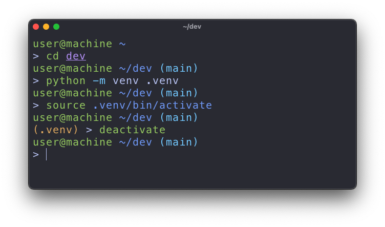

# zsh-git-venv-prompt



`zsh-git-venv-prompt` is a Zsh plugin that enhances your Zsh prompt with information about the current Python virtual environment and the Git status (asynchronously). It uses `zsh-async` to provide async updates for Git status and displays the virtual environment in the second line of the prompt.

## Features

- Displays the name of the active Python virtual environment (if any).
- Shows the current Git branch and changes (staged, unstaged, clean) asynchronously.
- Supports a two-line prompt:
  - First line: Username, hostname, and current directory.
  - Second line: Python virtual environment (if active), followed by Git status.

## Requirements

- [zsh-async](https://github.com/mafredri/zsh-async): This plugin requires `zsh-async` for asynchronous Git status updates.
- [zsh-vi-mode](https://github.com/jeffreytse/zsh-vi-mode) (optional): For vi-mode integration and mode indicators.

You can install the dependencies using a plugin manager like `znap`:

```sh
znap source mafredri/zsh-async
znap source jeffreytse/zsh-vi-mode  # Optional for vi-mode support
```

## Installation

### Using znap (Recommended)

To install this plugin using znap, add the following line to your .zshrc:

```sh
znap source walkingshamrock/zsh-git-venv-prompt
```

### Manual Installation

1. Clone the repository to your ~/.zsh/plugins/ directory:

```sh
git clone https://github.com/walkingshamrock/zsh-git-venv-prompt.git ~/.zsh/plugins/zsh-git-venv-prompt
```

1. Add the following line to your .zshrc:

```sh
source ~/.zsh/plugins/zsh-git-venv-prompt/zsh-git-venv-prompt.plugin.zsh
```

1. Reload your .zshrc:

```sh
source ~/.zshrc
```

## Configuration

The plugin automatically configures a two-line prompt:

1. First line: Displays your username, hostname, and current directory.
1. Second line: Displays the Python virtual environment (if active), followed by Git branch and status.

### Customization Options

You can customize the prompt symbols by setting these variables in your `.zshrc` before loading the plugin:

```sh
# Customize prompt symbols (optional)
export ZGVP_DEFAULT_SYMBOL="$"  # Default symbol (default: ">")
export ZGVP_INSERT_SYMBOL="#"   # Symbol for insert mode (default: ">", or ZGVP_DEFAULT_SYMBOL if set)
export ZGVP_NORMAL_SYMBOL="N"   # Symbol for normal mode (default: "<")
export ZGVP_VISUAL_SYMBOL="V"   # Symbol for visual mode (default: "<")
export ZGVP_REPLACE_SYMBOL="R"  # Symbol for replace mode (default: "<")

# Load the plugin
znap source walkingshamrock/zsh-git-venv-prompt
```

**Default behavior without any customization:**
- Insert mode and non-vi-mode: `>`
- Normal/Visual/Replace modes: `<`

**If you only set `ZGVP_DEFAULT_SYMBOL`:**
- Insert mode and non-vi-mode will use your default symbol
- Other modes still use `<` unless explicitly overridden

## Usage

Once installed, the plugin will automatically display:

- The name of the currently active Python virtual environment (if any).
- The current Git branch and status asynchronously:
  - `+` for staged changes
  - `*` for unstaged changes
  - `✔` for clean status (when no changes)

For example, your prompt will look like this:

```
user@hostname /path/to/dir (main) + *
(venv) > 
```

## Contributing

Contributions are welcome! If you find a bug or have an improvement, please open an issue or submit a pull request.

## Acknowledgements

Special thanks to [pure](https://github.com/sindresorhus/pure) for their inspiration and influence in designing the shell prompts.

## License

This plugin is licensed under the MIT License. See the LICENSE file for details.
